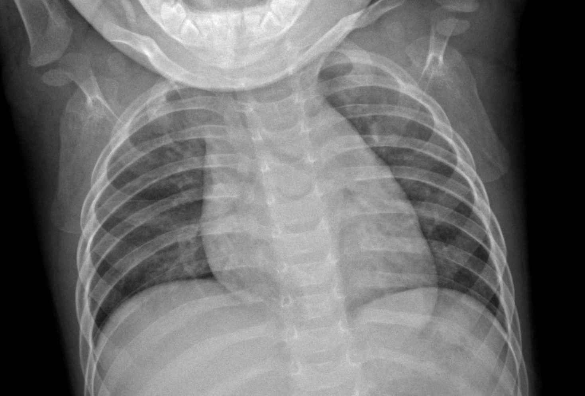
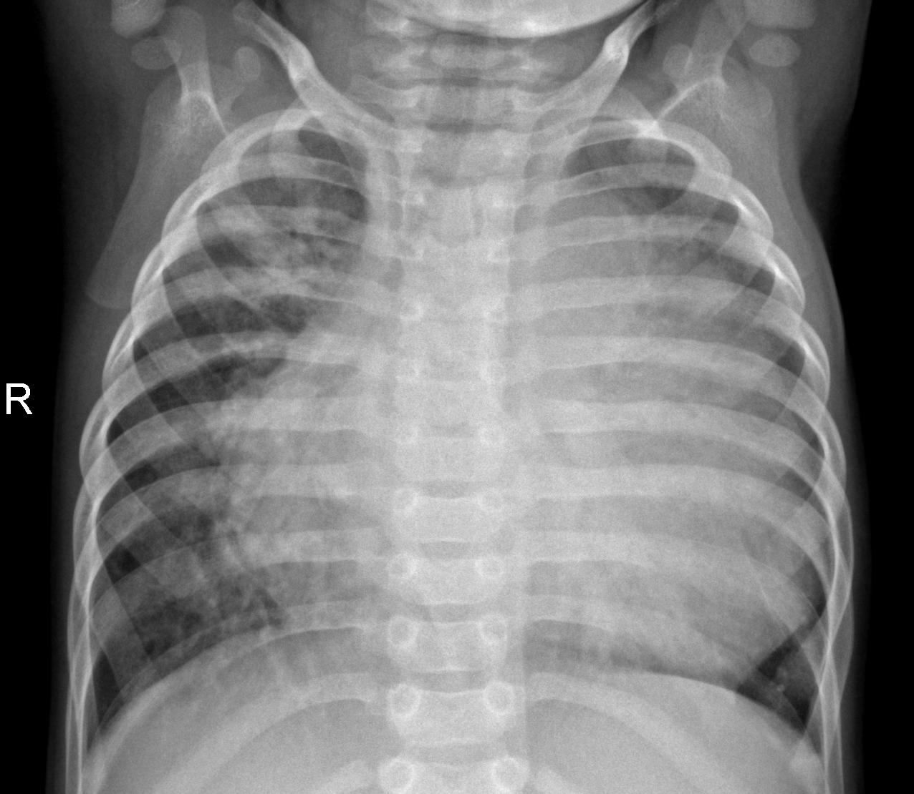

# X-Ray-Pneumonia-Image-Classification

Yuhkai Lin & Peter Burton

Link to our [Presentation](https://docs.google.com/presentation/d/1T57NZcnFOQudURk4JyrwX-yk_2hQXYutJAhIlV2DprA/edit#slide=id.p)

## Background & Business Problem

Pneumonia is responsible for more childhood deaths than any other infectious disease worldwide, and early diagnosis and treatment are critical for short-term and long-term health outcomes for patients. One of the most common and cost effective means of diagnosing pneuomonia is through chest X-rays. 
We are given the task of using X-Ray data from pediatric patients to create a model that can assist medical professionals in diagnosing and evaluating X-rays. 
Correctly identifying and diagnosing Pneumonia and beginning treatment sooner can lead to faster recovery and better patient results. 
Providing a “second opinion” to medical professionals after initial diagnosis can help prevent patients from being misdiagnosed and untreated. 

## Dataset

Dataset from Mendeley: https://data.mendeley.com/datasets/rscbjbr9sj/2

Sample of a Normal X-Ray

Sample of a Pneumonia X-ray

We are working from a dataset of  5,863 X-Ray images in two categories (Pneumonia/Normal). The Chest X-ray images were selected from pediatric patients ages one to five years old from Guangzhou Women and Children’s Medical Center. 
The dataset of images was then screened and graded by two expert physicians and then verified by a third party for accuracy. 
The dataset included a Train, Test, and Validation folder. Due to the low level of images in the validation folder, we created a train/test split from the Train data to create our own Train and Validation Images. 

## Modeling

We preprocessed images for modeling by using ImageDataGenerator to process images, dividing each image by 255 to adjust for greyscale, converting the image size to 64x64, and augmenting the data. 
We will use Convolutional Neural Network(CNN) algorithms to process and learn from thousands of images and predict from new X-rays if a patient has pneumonia.

Key metrics in our model:

•	Accuracy: Reliable predictions help medical professionals save time

•	Recall: Ensuring that we do not have any false negatives, since these could result in poor health outcomes

We will iterate through different models and choose a model that is able to give us the best results based around those parameters. 

## Dummy Classifier

Our first model is a dummy predictor model, that predicts based on the most frequent class(in this case pneumonia). The accuracy of this model is 74.3%. Since Dummy Classifier always chooses the most common class, it has a recall of 100%. 

## Baseline Model

Our next model was a baseline neural network model. We created a basic neural network with only dense layers.  Compared to the dummy model, the baseline model was substantially better, with an accuracy of 89% and a recall of 90%. 

## VGG19

To create a comparison model, we used VGG19, a pretuned model with 19 layers in it, to analyze the data set. We used both the base VGG19 layer and with added layers for transfer learning. The VGG19 model performed extremely well, with both an accuracy and recall of over 97%, giving us a strong comparison model for our CNN modeling. 

## Further CNN Models and Results

The two bar plots show our model's accuracy and recall scores on the validation data. The simple CNN model had the lowest metric scores which is good news since it means our iterative modeling process improved upon the simple CNN model. Accuracy for all models was similar, hovering above and below 93%. We believed that recall was a more important metric than accuracy. Recall is an indicator of false negative rates. Our focus with this modeling project is to provide a second opinion to doctors and ensure that no child with pneumonia is overlooked. It is more costly and dangerous if pneumonia-positive patients are overlooked and aren't able to receieve treatment quickly. The model is not meant to replace a doctor's diagnosis but rather provide a red flag so that a doctor can re-evaluate their initial diagnosis. When determining our best performing models, we wanted to pick out a model with a strong performance in recall.

When we compared each of our models, we decided that CNN 6 is our strongest performing model. It has an accuracy of 92.3% and recall of 98.2% on the validation set. Prioritizing recall will ensure that our model misclassifies as few patients as possible that are positive for Pneumonia. In fact, out of the 390 Pnuemonia cases in our test set of unseen data, it correctly diagnosed 386, a False-Negative rate of just 1%. Overall accuracy of our model is hindered by its false-positive rate.

If we were to continue to improve this model, our next steps would be to address overfitting and try increasing image resolution. We could try adding more regularization or dropout layers to hopefully improve this model's ability to predict on unseen data. Additionally, we could better train our model given more data or with higher quality data. Our model is trained on images of 64 x 64 resolution. Increasing resolution could provide more details for the model to learn from at the cost of computational time. Our training data set consisted of 4,173 images. One way to better train our model is to provide more data to our model through further image augmentation or additional X-ray images.

## Conclusion 

The goal of this project was to construct a CNN model to classify chest X-rays of pediatric patients and identify which X-rays showed indicators of pneumonia. This model could be used as a "second opinion" for doctors with the intent of catching all penumonia-positive patients. Since childhood pneumonia can be deadly if not treated, we focused on a model with the lowest false-negative rate.

Our final model had an overall accuracy of 86% and a recall of 0.98. Overfitting was one of the major hurdles in our modeling process which we addressed but did not manage eliminate from our models. On unseen data, our model correctly diagnosed 98% of all pneumonia-labeled X-rays. This model met our goal of reducing false-negative rate while improving on accuracy over previous model iterations.

Wtih any project, there is room for improvement and continued progress. Steps that we would like to take to tune our model include additional techniques to address overfitting, testing the model on images of different quality, and identifying if there are particular X-rays that doctors are consistently missing that a neural network might be able to assist with.

To dive deeper into our project, please checkout our [Notebook](https://github.com/yuhkulele/X-Ray-Pneumonia-Image-Classification/blob/main/notebook.ipynb)!
